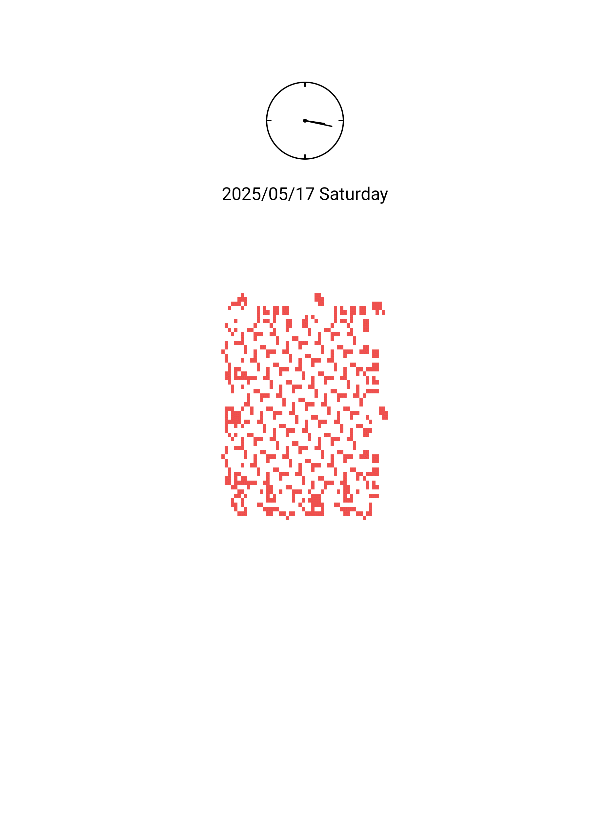
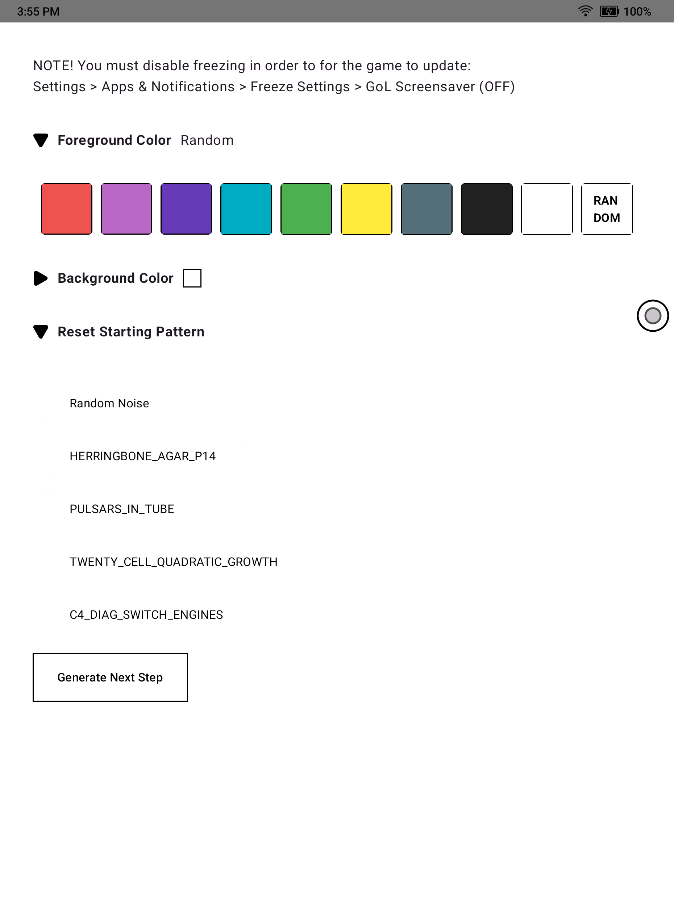

# GoL Screensaver

GoL Screensaver is an app that generates and updates screensavers for Onyx Boox using [Conway's Game of Life Algorithm](https://en.wikipedia.org/wiki/Conway%27s_Game_of_Life). Optimized for e-ink screens!

 

## 🎨 Features
- Auto-updating screensaver based on Conway's Game of Life
  - Note that wallpaper will not update while the screen is locked, only on the next unlock -> lock.

- Customizable foreground and background colors (chosen specifically for color e-ink)
- Pattern picker for common Game of Life starting states

## 🏄 Usage
1. **Install the app** on your Android device using F-Droid or building from source.
2. ⚠️ **Disable freezing** in order to for the game to self-update
   - Settings > Apps & Notifications > Freeze Settings > GoL Wallpaper (OFF)
   - **Note:** Updates happen at most every 15 minutes and **only** with sufficient battery

3. **Launch the app**:
   - (Optional) Choose foreground and background colors in the app
   - (Optional) Pick a starting pattern 
   - (Optional) Tap "Generate Next Step" to advance the Game of Life and update your wallpaper

## 🤝 Contributing

[Pull requests](https://github.com/hbmartin/onyx-boox-screensaver-gol/pulls) and [feature requests / bug reports](https://github.com/hbmartin/onyx-boox-screensaver-gol/issues) are welcome!

This project uses Kotlin and Jetpack Compose with **no** 3rd party dependencies and is checked by [detekt](https://detekt.dev/) with [hbmartin's rules](https://github.com/hbmartin/hbmartin-detekt-rules).

1.  Fork the repository and `git clone`
2.  Create a new branch `git checkout -b cool-feature-name`
3.  Open in Android Studio, sync Gradle, and start hacking!
4.  Ensure checks are passing by running `./gradlew detektMain`
5.  Commit your changes `git commit -am 'Description of what changed'`
6.  Push to the branch `git push origin head`
7.  Create a new [Pull Request](https://github.com/hbmartin/onyx-boox-screensaver-gol/pulls)

### Project Structure
- `app/src/main/java/me/haroldmartin/golwallpaper/` – Main source code
  - `domain/` – Game of Life logic and patterns
  - `ui/` – Jetpack Compose UI components
  - `utils/` – Utility functions (saving wallpaper, color picking, etc.)

## ✍️ Authors

* [Harold Martin](https://www.linkedin.com/in/harold-martin-98526971/) - harold.martin at gmail dot com
* Triangle disclosure icon from [Compose Icons / Lucide](https://composeicons.com/icons/lucide/triangle)
* Inspiration from [WanderWall by fmeyer](https://github.com/fmeyer/WanderWall)

## ⚖️ License
[MIT License](LICENSE.txt) with addendum: it's legally required for you to do at least one of have fun with this or report an issue explaining why not, no takesies backsies.
